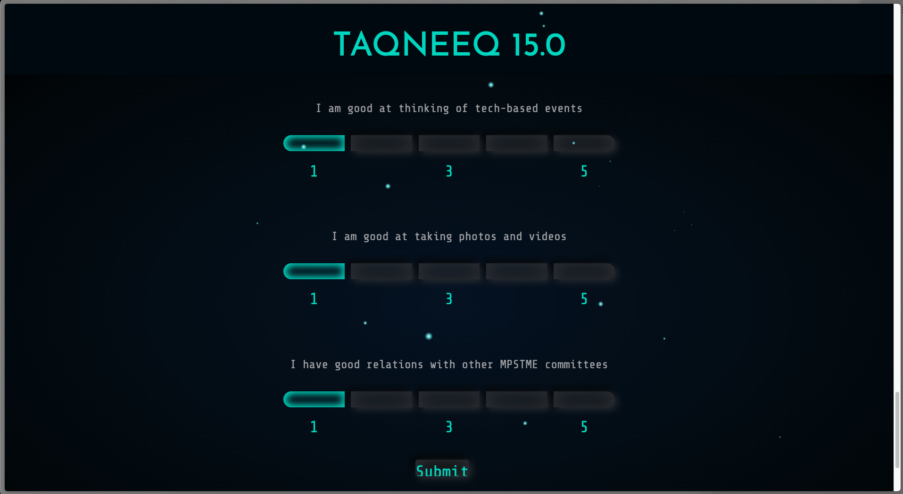
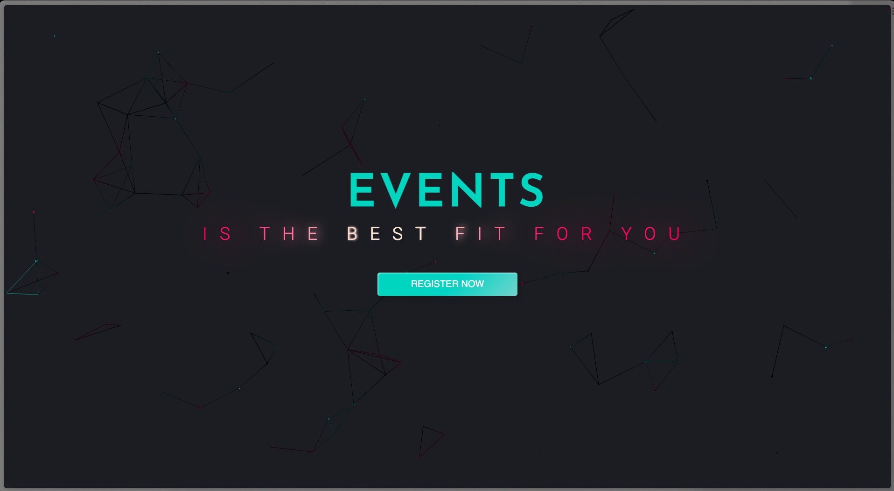

# Department Classifier - Naive Bayes

This web application is designed to help new students determine which department is the best fit for them if they join the committee. It utilizes a form-like page where users can answer 15-20 questions using a scale of 1 to 5, with 3 being considered neutral. The backend of the application employs a Naive Bayes algorithm trained on a dataset to predict the department that the student is most likely to belong to.
## Features
- User-friendly interface: The web application provides an intuitive and easy-to-use interface for users to answer the questions and receive their department prediction.

- Scale-based responses: The questions in the form can be answered using a scale of 1 to 5, allowing users to express their preferences and opinions clearly.

- Naive Bayes algorithm: The backend of the application utilizes the Naive Bayes algorithm, a popular machine learning technique, to classify and predict the department based on the user's responses.

- Dataset-driven predictions: The algorithm is trained on a dataset that contains previous responses and corresponding department labels, ensuring accurate predictions based on past information.
## Demo

Try the app: https://induction.taqneeqfest.com/






## Tech Stack
**Flask:** The web application is built using the Flask framework, a lightweight and efficient Python web framework.

**Python:** The backend logic and machine learning implementation are written in Python, leveraging its extensive libraries and tools for data analysis and machine learning.

**JavaScript:** JavaScript is used to send the data to the python endpoint and display the results on result page.

**TailwindCSS & Bootstrap:** The application's user interface is styled using TailwindCSS & Bootstrap to provide an appealing and visually consistent experience with animation and dynamic background.
## Run Locally
Clone the repository to your local machine.
```bash
git clone https://github.com/your-username/department-prediction-webapp.git
```

Install the required dependencies using pip.
```bash
pip install -r requirements.txt
```

Start the Flask development server.
```bash
python app.py
```

Open your web browser and navigate to http://localhost:5000 to access the web application.

Fill out the form by answering the questions using the provided scale, and click on the "Submit" button to get your department prediction.
## Contributing

Contributions to this project are welcome! If you encounter any issues or have suggestions for improvement, please feel free to submit a pull request or open an issue on the GitHub repository.


## Acknowledgements

The Naive Bayes algorithm implementation is based on the scikit-learn library (https://scikit-learn.org/), a powerful and widely-used machine learning library in Python.

The Flask web framework (https://flask.palletsprojects.com/) and its documentation have been instrumental in the development of this project.

Special thanks to the contributors and maintainers of the open-source libraries used in this project.
